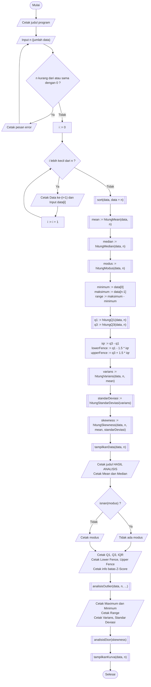
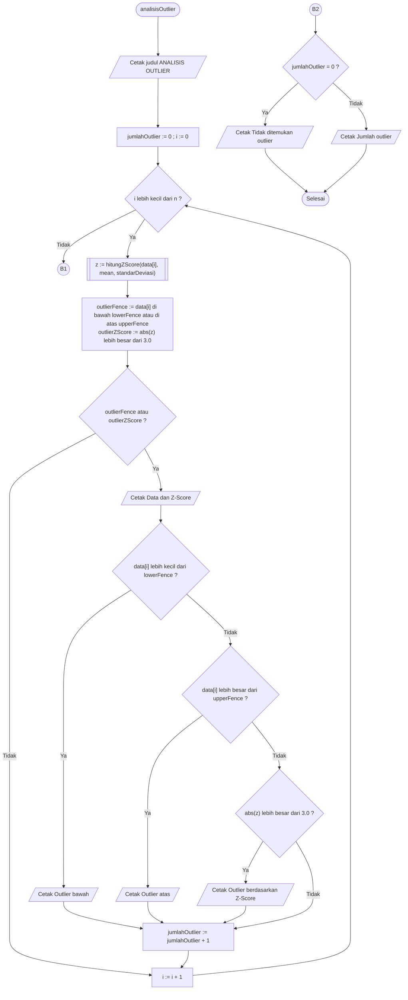
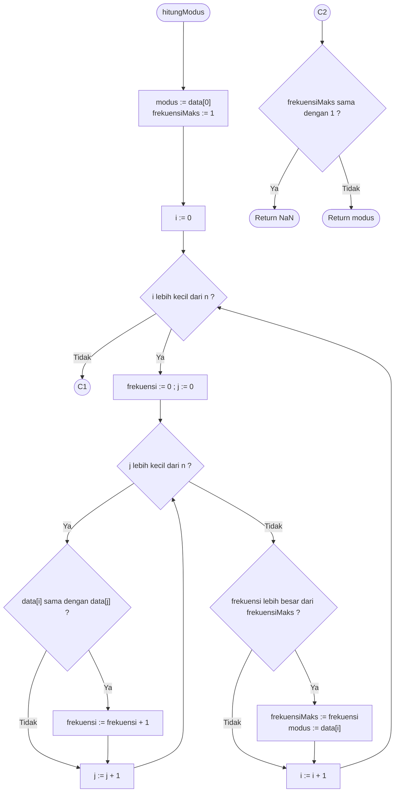

# Dokumentasi Program Analisis Statistika

Dokumentasi ini berisi diagram alir (flowchart) serta penjelasan logis untuk program utama dan fungsi-fungsi pendukungnya.

---

## 1. Flowchart Utama (Program Utama / `main`)

Flowchart ini menggambarkan alur kerja program utama mulai dari input data, pengurutan, kalkulasi statistik, hingga penyajian kurva.

### Penjelasan Alur (Program Utama)
1. **Inisialisasi & Validasi Input**: Program mencetak judul, lalu meminta jumlah data `n`. Jika n ≤ 0, program mencetak pesan error dan meminta `n` dimasukkan ulang sampai valid.
2. **Penginputan Array**: Perulangan `i` dari `0` sampai `n-1` membaca setiap nilai `data[i]`.
3. **Pengurutan Data**: `sort(data, data + n)` mengurutkan data dari kecil ke besar (ascending).
4. **Kalkulasi Statistika**:
   * Menghitung `mean`, `median`, dan `modus`.
   * Menentukan `minimum` (`data[0]`), `maksimum` (`data[n-1]`), dan `range`.
   * Menghitung `q1` dan `q3`, lalu `iqr`, `lowerFence`, dan `upperFence`.
   * Menghitung ukuran sebaran: `varians`, `standarDeviasi`, dan `skewness`.
5. **Output Hasil & Pemanggilan Modul**:
   * Menampilkan data yang sudah terurut.
   * Mencetak mean dan median. Untuk modus, program mengecek `isnan(modus)`: jika benar dicetak "Tidak ada modus", jika tidak dicetak nilai modusnya.
   * Mencetak Q1, Q3, IQR, kedua fence, dan keterangan batas Z-Score (|Z| > 3).
   * Memanggil `analisisOutlier` untuk mendeteksi outlier, lalu mencetak maksimum, minimum, range, varians, dan standar deviasi.
   * Memanggil `analisisEkor` untuk menafsirkan bentuk ekor distribusi dari skewness, dan `tampilkanKurva` untuk menampilkan kurva frekuensi.
   * Program selesai.

---

## 2. Flowchart 2: Fungsi `analisisOutlier`

Flowchart ini menggambarkan proses deteksi pencilan (outlier) menggunakan dua metode sekaligus: metode jangkauan antar-kuartil (*Fence/IQR*) dan metode *Z-Score*.

### Penjelasan Alur (`analisisOutlier`)
1. **Inisialisasi**: `jumlahOutlier = 0` dan `i = 0`.
2. **Pemeriksaan Per-Elemen**:
   * Untuk tiap `data[i]`, hitung skor `z` dengan `hitungZScore()`.
   * Cek dua syarat: data berada di luar fence (`< lowerFence` atau `> upperFence`) **ATAU** |z| > 3.0. Data dianggap outlier jika salah satunya terpenuhi.
3. **Pengkategorian Outlier**:
   * Jika outlier, cetak nilai data beserta skor Z-nya.
   * Jenisnya ditentukan berurutan: **Outlier bawah** (`< lowerFence`), jika tidak maka **Outlier atas** (`> upperFence`), jika tidak maka **Outlier berdasarkan Z-Score**.
   * `jumlahOutlier` bertambah 1.
   * Jika bukan outlier, program langsung lanjut ke data berikutnya.
4. **Keluaran Akhir**: Setelah semua data diperiksa (`i >= n`), jika `jumlahOutlier == 0` dicetak "Tidak ditemukan outlier". Jika tidak, dicetak jumlah outlier.

---

## 3. Flowchart 3: Fungsi `hitungModus`

Flowchart ini memperlihatkan algoritma pencarian nilai yang paling sering muncul (modus) di dalam array.

### Penjelasan Alur (`hitungModus`)
1. **Inisialisasi**: Kandidat `modus = data[0]` dan `frekuensiMaks = 1`.
2. **Nested Loop (Perulangan Bersarang)**:
   * **Loop luar (`i`)**: mengambil satu data sebagai acuan.
   * **Loop dalam (`j`)**: membandingkan `data[i]` dengan seluruh data. Setiap kali sama (`data[i] == data[j]`), `frekuensi` bertambah 1.
3. **Pembaruan Modus**: Setelah loop dalam selesai, jika `frekuensi > frekuensiMaks`, maka `frekuensiMaks` dan `modus` diperbarui. Karena pembandingnya `>`, jika ada beberapa nilai dengan frekuensi sama, yang terpilih adalah yang pertama ditemukan (yang terkecil, karena data sudah terurut).
4. **Hasil Akhir**: Jika `frekuensiMaks == 1` (semua data hanya muncul sekali), fungsi mengembalikan `NaN`. Jika tidak, fungsi mengembalikan `modus`.

---

## 4. Fungsi Pendukung

* `hitungMean`: jumlah seluruh data dibagi `n`.
* `hitungMedian`: jika `n` genap, rata-rata dua nilai tengah. Jika ganjil, nilai tengah.
* `hitungQ1` dan `hitungQ3`: posisi `n/4` dan `3n/4` pada data terurut. Jika posisinya pas (habis dibagi 4), diambil rata-rata dua nilai di sekitarnya. Jika tidak, diambil nilai pada posisi tersebut.
* `hitungVarians`: rata-rata kuadrat selisih data terhadap mean, dibagi `n` (varians populasi, bukan `n-1`).
* `hitungStandarDeviasi`: akar kuadrat dari varians.
* `hitungSkewness`: rata-rata dari pangkat tiga skor standar `((x - mean) / SD)^3`. Jika SD = 0, hasilnya 0.
* `hitungZScore`: `(nilai - mean) / SD`. Jika SD = 0, hasilnya 0.
* `analisisEkor`: skewness > 0.5 berarti ekor kanan (miring kanan), skewness < -0.5 berarti ekor kiri (miring kiri), selain itu relatif simetris.
* `tampilkanKurva`: mengelompokkan nilai unik beserta frekuensinya, lalu menggambar grafik bintang (`*`). Tinggi tiap kolom sama dengan frekuensi nilainya. Baris digambar dari atas ke bawah, lalu diberi sumbu X dan label nilai.
